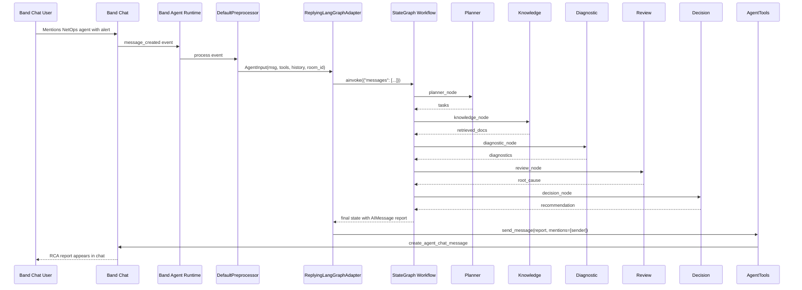

# NetOps Band Message Flow

```mermaid
sequenceDiagram
    participant User as Band Chat User
    participant Band as Band Chat
    participant Runtime as Band Agent Runtime
    participant Preprocessor as DefaultPreprocessor
    participant Adapter as ReplyingLangGraphAdapter
    participant Graph as StateGraph Workflow
    participant Planner as Planner
    participant Knowledge as Knowledge
    participant Diagnostic as Diagnostic
    participant Review as Review
    participant Decision as Decision
    participant Tools as AgentTools

    User->>Band: Mentions NetOps agent with alert
    Band->>Runtime: message_created event
    Runtime->>Preprocessor: process event
    Preprocessor->>Adapter: AgentInput(msg, tools, history, room_id)
    Adapter->>Graph: ainvoke({"messages": [...]})
    Graph->>Planner: planner_node
    Planner-->>Graph: tasks
    Graph->>Knowledge: knowledge_node
    Knowledge-->>Graph: retrieved_docs
    Graph->>Diagnostic: diagnostic_node
    Diagnostic-->>Graph: diagnostics
    Graph->>Review: review_node
    Review-->>Graph: root_cause
    Graph->>Decision: decision_node
    Decision-->>Graph: recommendation
    Graph-->>Adapter: final state with AIMessage report
    Adapter->>Tools: send_message(report, mentions=[sender])
    Tools->>Band: create_agent_chat_message
    Band-->>User: RCA report appears in chat
```
